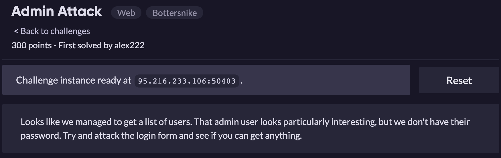
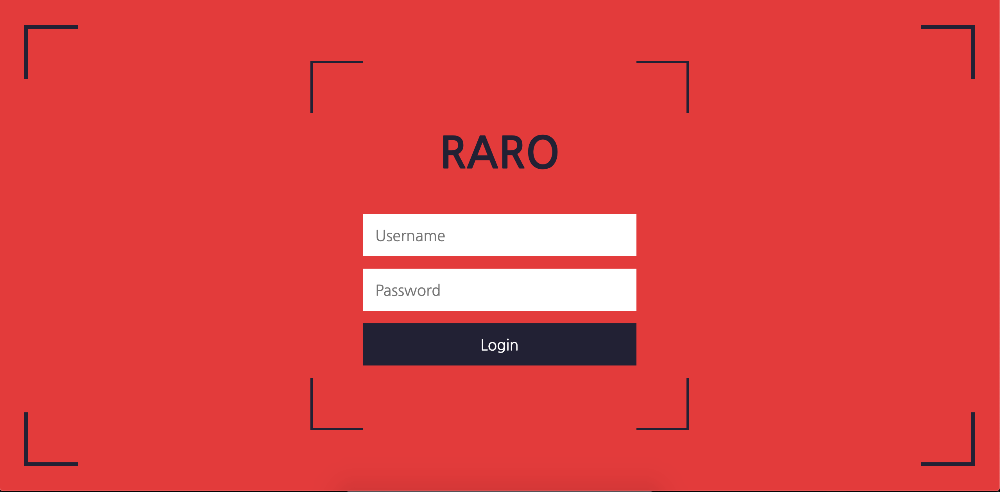
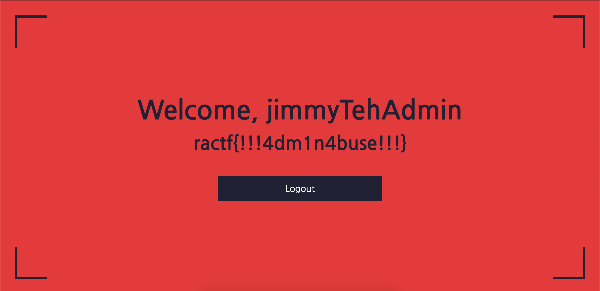

Dựa vào tài khoản develop từ bài [Entry Point](EntryPoint.md) đăng nhập vào thử ta thu được:

Ta nhận thấy tài khoản **jimmyTehAdmin** được in đậm và có từ **Admin** trong chuỗi, nên rất có thể là tài khoản admin. Thử sqli với form đăng nhập

Payload: username=**jimmyTehAdmin' or password LIKE 'a%’—**&password=1

Flag: **ractf{!!!4dm1n4buse!!!}**

