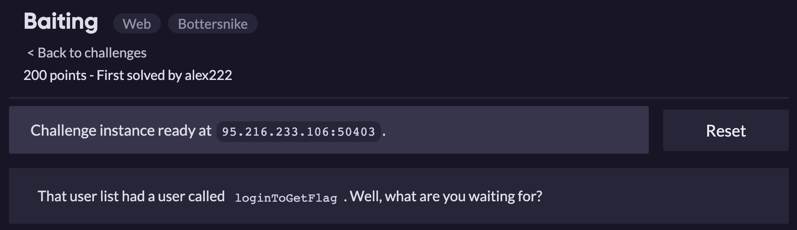
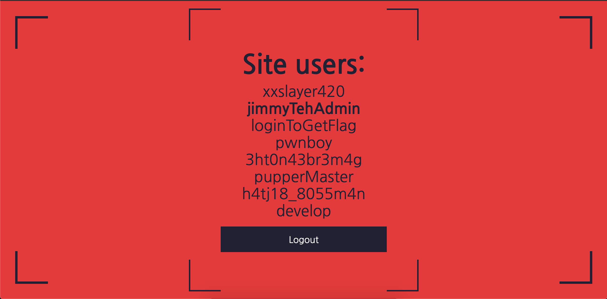
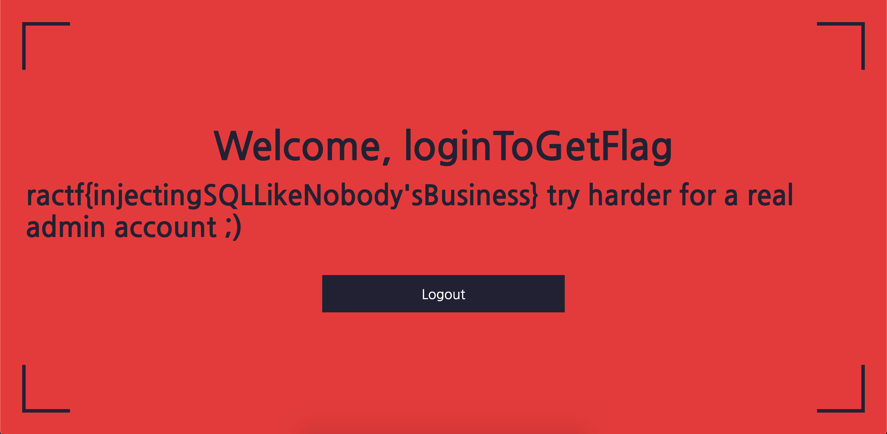

Dựa vào tài khoản develop từ bài [Entry Point](EntryPoint.md) đăng nhập vào thử ta thu được:

Đề bài có gợi ý sử dụng tài khoản **loginToGetFlag**

=> Ta thử sqli với form đăng nhập, có thể truy vấn tay hoặc sử dụng sqlmap :v

Payload: username=**loginToGetFlag’—**&password=

Flag: **ractf{injectingSQLLikeNobody'sBusiness}**

