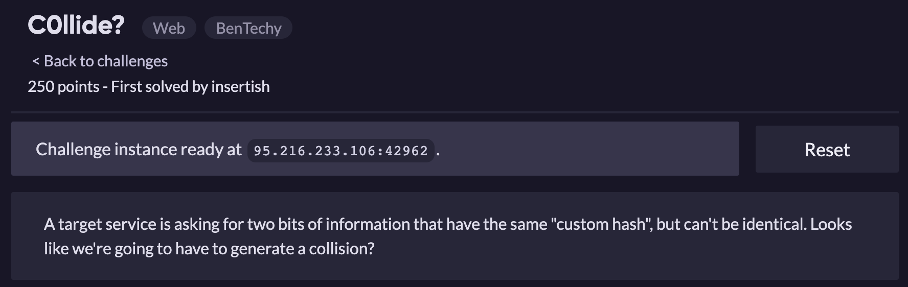
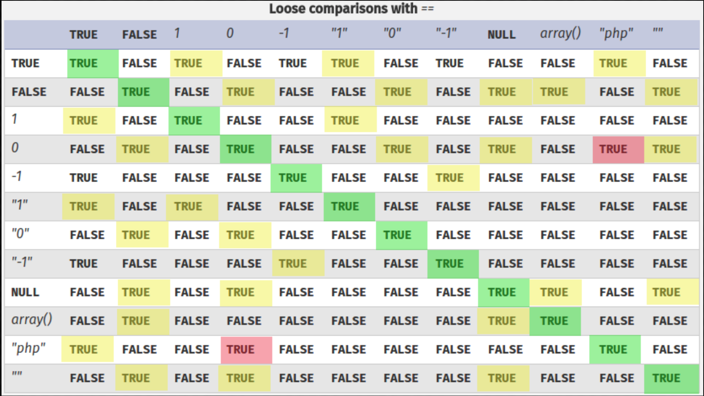

```
const bodyParser = require("body-parser")
const express = require("express")
const fs = require("fs")
const customhash = require("./customhash")

const app = express()
app.use(bodyParser.json())

const port = 3000
const flag = "flag"
const secret_key = "Y0ure_g01nG_t0_h4v3_t0_go_1nto_h4rdc0r3_h4ck1ng_m0d3"

app.get('/', (req, res) => {
    console.log("[-] Source view")
    res.type("text")
    return fs.readFile("index.js", (err,data) => res.send(data.toString().replace(flag, "flag")))
})

app.post('/getflag', (req, res) => {
    console.log("[-] Getflag post")
    if (!req.body) {return res.send("400")}
    let one = req.body.one
    let two = req.body.two
    console.log(req.body)
    if (!one || !two) {
        return res.send("400")
    }
    if ((one.length !== two.length) || (one === two)) {
        return res.send("Strings are either too different or not different enough")
    }
    one = customhash.hash(secret_key + one)
    two = customhash.hash(secret_key + two)
    if (one == two) {
        console.log("[*] Flag get!")
        return res.send(flag)
    } else {
        return res.send(`${one} did not match ${two}!`)
    }
})

app.listen(port, () => console.log(`Listening on port ${port}`))
```

Đọc lướt qua thì mình biết endpoint /getflag có vẻ sẽ chứa flag

- Path: /getflag

- Phương thức: POST

- Kiểm tra có dữ liệu post lên không => Nếu không response 400
- 1 trong 2 chuỗi là truthy  => response 400
- Độ dài 2 chuỗi khác nhau hoặc 2 chuỗi cùng giá trị và kiểu => response 400
- 2 chuỗi cùng giá trị (loose comparisons) => Flag




**<u>*=> Type Juggling Bug*</u>**

=> Payload: curl -X POST http://95.216.233.106:42962/getflag --header "Content-Type: application/json" --data '{"one": [],"two": []}'

=> Flag: **ractf{Y0u_R_ab0uT_2_h4Ck_t1Me__4re_u_sur3?}**

