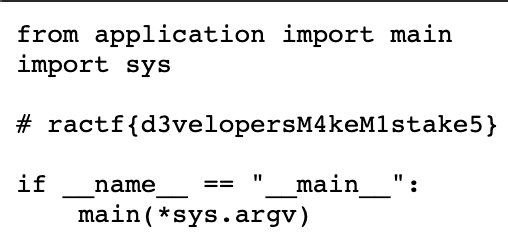

Truy cập path 

/robots.txt => OK

/static/robots.txt => OK

static?f=robots.txt => OK

Đều ra chung 1 kết quả => có thể truy cập file render ra trang chủ, có thể scan để tìm ra file, còn mình thì đoán thôi :))

Payload: /static?f=main.py

Flag: ractf{d3velopersM4keM1stake5}

