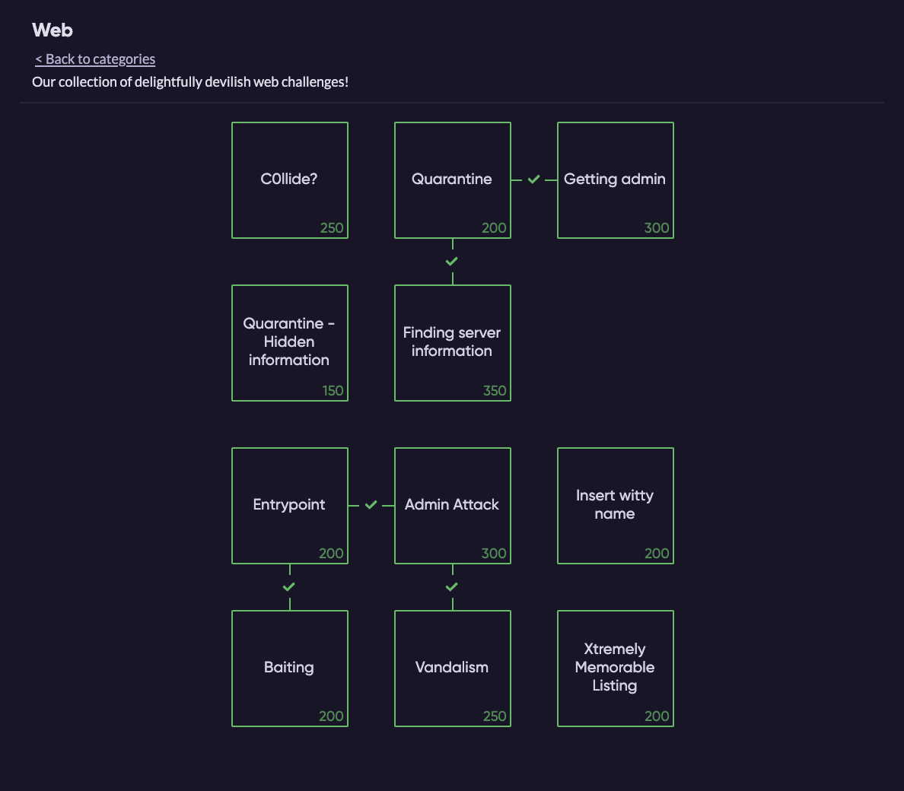

# WRITE-UP Really Awesome CTF

## URL: https://2020.ractf.co.uk/

### Table of contents:

| Name                            | DESCRIPTION                                                  | Link                                                         |
| ------------------------------- | ------------------------------------------------------------ | ------------------------------------------------------------ |
| C0llide?                        | A target service is asking for two bits of information that have the same "custom hash", but can't be identical. Looks like we're going to have to generate a collision? | [C0llide?](C0llide.md)                                       |
| Quarantine                      | See if you can get access to an account on the we            | [Quarantine](Quarantine.md)                                  |
| Quarantine - Hidden information | We think there's a file they don't want people to see hidden somewhere! See if you can find it, it's gotta be on their webapp somewhere... | [QuarantineHidden Information](QuarantineHiddenInformation.md) |
| Finding server information      | See if you can find the source, we think it's called app.py  | [FindingServerInformation](FindingServerInformation.md)      |
| Getting admin                   | See if you can get an admin account.                         | [GettingAdmin](GettingAdmin.md)                              |
| Entrypoint                      | Sadly it looks like there wasn't much to see in the python source. We suspect we may be able to login to the site using backup credentials, but we're not sure where they might be. Encase the password you find in `ractf{...}` to get the flag. | [Entrypoint](Entrypoint.md)                                  |
| Admin Attack                    | Looks like we managed to get a list of users. That admin user looks particularly interesting, but we don't have their password. Try and attack the login form and see if you can get anything. | [AdminAttack](AdminAttack.md)                                |
| Baiting                         | That user list had a user called `loginToGetFlag`. Well, what are you waiting for? | [Baiting](Baiting.md)                                        |
| Vandalism                       | That admin panel was awfully bare. There must be some other page, but we've no idea where it is. *Just to clarify, `ractf{;)}` is the greedy admins stealing all the flags, it's not the actual flag.* | [Vandalism](Vandalism.md)                                    |
| Insert witty name               | Having access to the site's source would be really useful, but we don't know how we could get it. All we know is that the site runs python. | [Insert witty name](Insertwittyname.md)                      |
| Xtremely Memorable Listing      | We've been asked to test a web application, and we suspect there's a file they used to provide to search engines, but we can't remember what it used to be called. Can you have a look and see what you can find? | [XtremelyMemorableListing](XtremelyMemorableListing.md)      |

