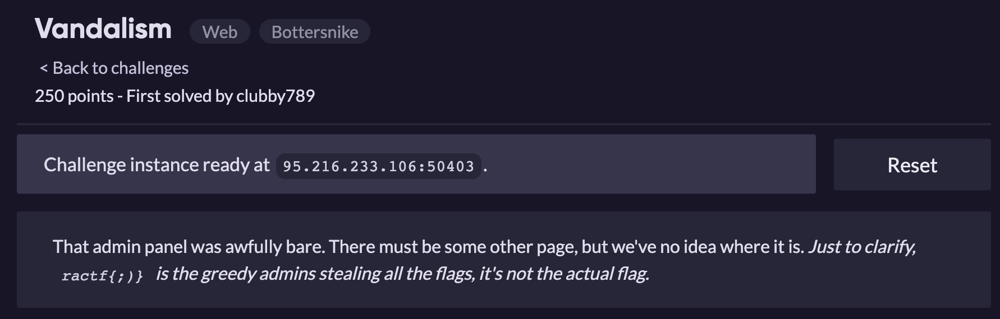
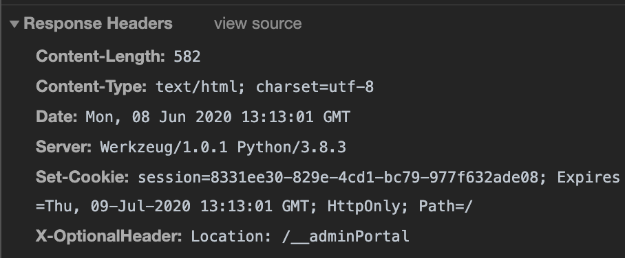
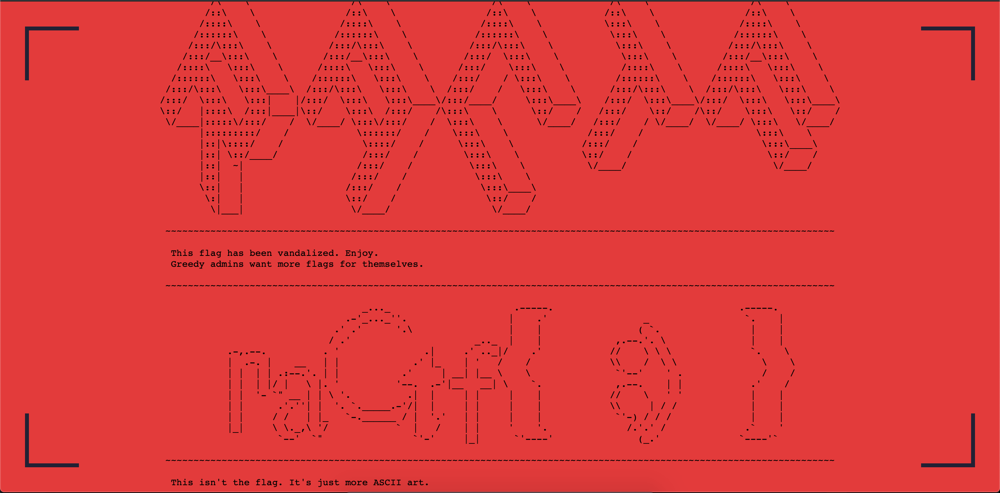
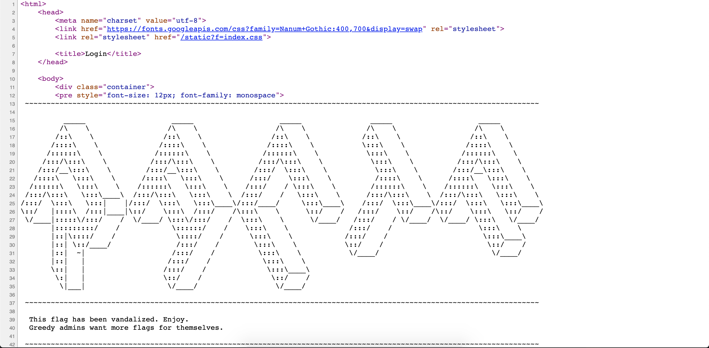
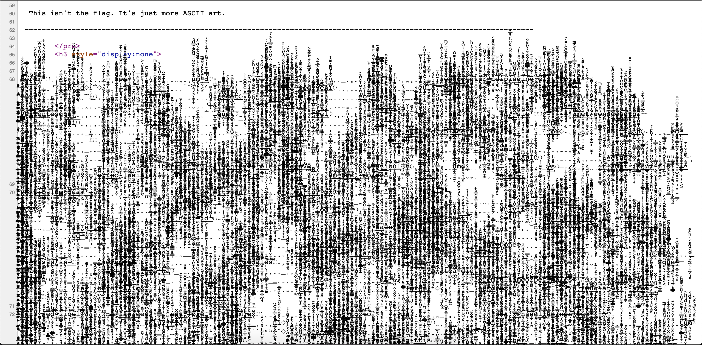
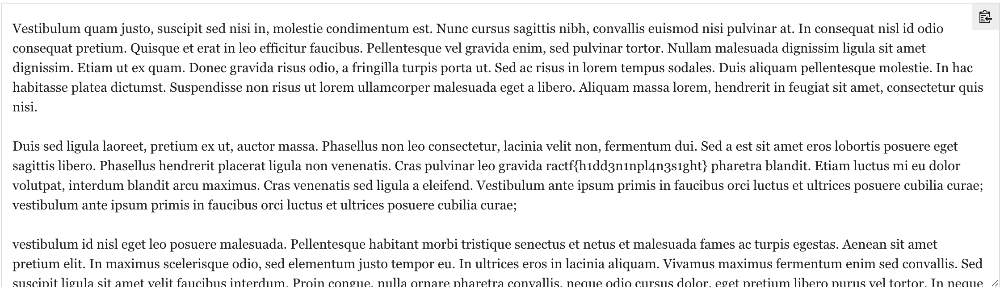

Đọc qua description của nó thì ta có thể thấy nó gợi ý cho ta phải tìm 1 trang khác, khác trang quản trị. Và ractf{;)} chỉ không phải là flag :v

Dựa vào tài khoản jimmyTehAdmin đã đề cập trước đó ở bài [AdminAttack](AdminAttack.md), ta đọc thử response header của nó

Có xuất hiện 1 đường dẫn mới /__adminPortal. Sau khi truy cập:

Phần flag đã bị làm nhiễu :v. Chúng ta sử dụng công cụ https://textcleaner.net/ để loại bỏ nhiễu(thực chất là loại bỏ các kí tự non-ASCII)

=> Flag: **ractf{h1dd3n1npl4n3s1ght}**

